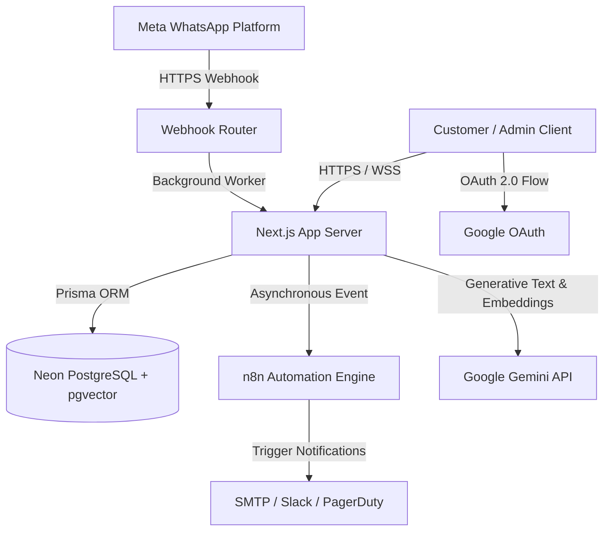
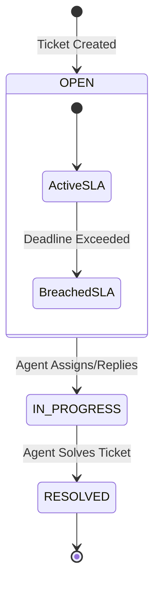

# FlowDesk AI - System Architecture Documentation

This document provides a detailed breakdown of FlowDesk AI's system architecture, event-driven data flows, database design, and key service integrations.

---

## 1. System Architecture Overview

FlowDesk AI is built on a modern, event-driven, decoupled architecture designed for high throughput, security, and low latency.



---

## 2. Event-Driven Data Flows

### A. WhatsApp Messaging & Ticket Escalation Flow
When a customer sends a message to the WhatsApp Support number:

```mermaid
sequenceDiagram
    autonumber
    actor Customer as WhatsApp Customer
    participant Meta as Meta Cloud API
    participant NextJS as Next.js Webhook Router
    participant DB as Neon (PostgreSQL)
    participant Gemini as Google Gemini AI
    participant n8n as n8n Automation Engine

    Customer->>Meta: Sends text message
    Meta->>NextJS: POST /api/webhooks/whatsapp (Signed)
    
    Note over NextJS: 1. Verify Signature (HMAC-SHA256)<br/>2. Check Idempotency Cache
    NextJS-->>Meta: Return HTTP 200 OK (Under 200ms)
    
    Note over NextJS: Spawn Background worker (waitUntil)
    rect rgb(30, 30, 30)
        NextJS->>DB: Fetch/Create Conversation Session
        NextJS->>DB: Query RAG context (pgvector <=> query)
        NextJS->>Gemini: Call Gemini 2.5 Flash (Query + Grounding Chunks)
        Gemini-->>NextJS: Returns reply text & triage evaluation JSON
        
        alt Needs Escalation == true
            NextJS->>DB: Create Ticket (Category, Priority, Sentiment)
            NextJS->>DB: Log Ticket Timeline Activities
            NextJS->>n8n: POST /webhook/new-ticket (Non-blocking)
            NextJS->>n8n: POST /webhook/escalate-ticket (Non-blocking)
        end
        
        NextJS->>Meta: Send outbound WhatsApp Reply API call
        NextJS->>DB: Log message transcript
    end
    Meta->>Customer: Delivers WhatsApp reply
```



---

## 3. Core Subsystems

### A. Retrieval-Augmented Generation (RAG) Flow
The RAG pipeline grounds Gemini support responses using organizational files, avoiding LLM hallucinations:

1. **Context Extraction**: Admin uploads a document (TXT, PDF, or DOCX) in the Knowledge Base UI.
2. **Text Segmentation**: The parser splits text into 1000-character segments with a 200-character sliding-window overlap to preserve semantic context across chunk boundaries.
3. **Vector Embeddings**: Generates 3072-dimensional vector arrays for each chunk using `gemini-embedding-001`.
4. **pgvector Storage**: Vectors are stored in a Neon PostgreSQL database using the `Unsupported("vector(3072)")` custom column.
5. **Similarity Match**: Incoming customer questions are converted to embeddings. The database matches them using cosine distance:
   ```sql
   SELECT content, similarity 
   FROM "DocumentChunk" 
   ORDER BY embedding <=> $1::vector 
   LIMIT 5;
   ```
6. **Prompt Augmentation**: Best matches above the similarity threshold ($>60\%$) are injected into the Gemini context.

---

### B. Enterprise SLA Engine
FlowDesk AI tracks service-level compliance for tickets:



- **Deadline Calculator**: SLA deadlines are automatically calculated on ticket creation:
  - **HIGH/CRITICAL**: 15m Response Target / 1h Resolution Target.
  - **MEDIUM**: 1h Response Target / 4h Resolution Target.
  - **LOW**: 4h Response Target / 24h Resolution Target.
- **Background Monitor**: A background cron service evaluates tickets against target times. If a breach is detected:
  - Updates `slaBreached = true` in the database.
  - Logs a timeline breach activity.
  - Fires the `triggerSlaBreachWebhook` non-blocking call to notify on-call teams.

---

### C. Webhook Hardening & Security
Meta mandates a **5-second response timeout** on webhooks. The webhook route incorporates:
1. **Immediate Acknowledgment**: Responds with `200 OK` under 200ms, shifting heavy processing to Next.js background workers (`NextRequest.waitUntil`).
2. **HMAC-SHA256 Verification**: Verifies the `X-Hub-Signature-256` header against the local `WHATSAPP_APP_SECRET` to prevent request forgery.
3. **Idempotency sliding-window**: Filters out duplicate carrier retries using a fast, memory-bounded cache.

---

## 4. Database Schema Design

FlowDesk AI uses Prisma ORM linked to Neon. Important relationships include:

- **User**: Represents support agents. Has relationships with `Ticket` and `Activity` tables.
- **Ticket**: Represents support incidents. Stores SLA parameters, priorities, category classifications, and links to `Activity` timelines.
- **WhatsAppConversation**: Tracks the stateful chat session with the customer (`OPEN`, `ESCALATED`, `RESOLVED`) and ties incoming messages to a created `Ticket`.
- **KnowledgeDocument & DocumentChunk**: Stores ingested organizational files and high-dimensional vector representations.

```text
+-------------------+       +--------------------+
|  KnowledgeDoc     |       |  DocumentChunk     |
+-------------------+       +--------------------+
| id (PK)           |------>| id (PK)            |
| title             |       | documentId (FK)    |
| fileName          |       | content (Text)     |
| status (Enum)     |       | embedding (Vector) |
+-------------------+       +--------------------+
```
