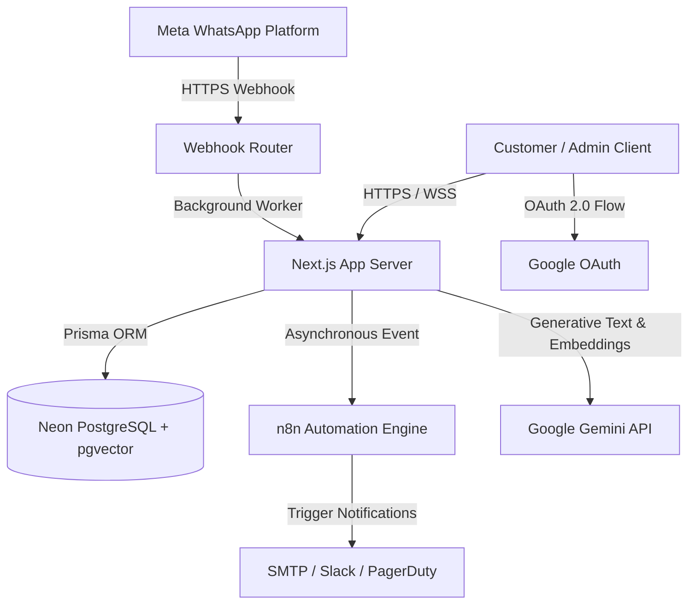
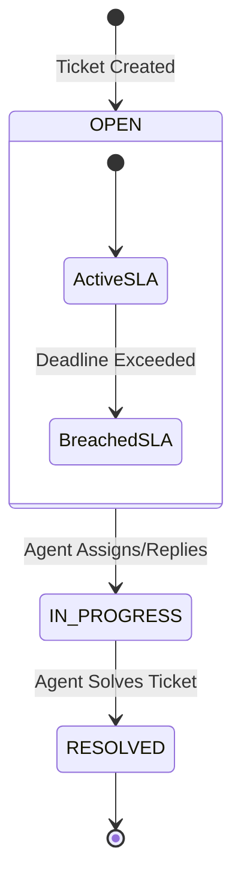

# FlowDesk AI - System Architecture Documentation

This document provides a detailed breakdown of FlowDesk AI's system architecture, event-driven data flows, database design, and key service integrations.

---

## 1. System Architecture Overview

FlowDesk AI is built on a modern, event-driven, decoupled architecture designed for high throughput, security, and low latency.



---

## 2. Event-Driven Data Flows

### A. WhatsApp Messaging & Ticket Escalation Flow
When a customer sends a message to the WhatsApp Support number:

```mermaid
sequenceDiagram
    autonumber
    actor Customer as WhatsApp Customer
    participant Meta as Meta Cloud API
    participant NextJS as Next.js Webhook Router
    participant DB as Neon (PostgreSQL)
    participant Gemini as Google Gemini AI
    participant n8n as n8n Automation Engine

    Customer->>Meta: Sends text message
    Meta->>NextJS: POST /api/webhooks/whatsapp (Signed)
    
    Note over NextJS: 1. Verify Signature (HMAC-SHA256)<br/>2. Check Idempotency Cache
    NextJS-->>Meta: Return HTTP 200 OK (Under 200ms)
    
    Note over NextJS: Spawn Background worker (waitUntil)
    rect rgb(30, 30, 30)
        NextJS->>DB: Fetch/Create Conversation Session
        NextJS->>DB: Query RAG context (pgvector <=> query)
        NextJS->>Gemini: Call Gemini 2.5 Flash (Query + Grounding Chunks)
        Gemini-->>NextJS: Returns reply text & triage evaluation JSON
        
        alt Needs Escalation == true
            NextJS->>DB: Create Ticket (Category, Priority, Sentiment)
            NextJS->>DB: Log Ticket Timeline Activities
            NextJS->>n8n: POST /webhook/new-ticket (Non-blocking)
            NextJS->>n8n: POST /webhook/escalate-ticket (Non-blocking)
        end
        
        NextJS->>Meta: Send outbound WhatsApp Reply API call
        NextJS->>DB: Log message transcript
    end
    Meta->>Customer: Delivers WhatsApp reply
```



---

## 3. Core Subsystems

### A. Retrieval-Augmented Generation (RAG) Flow
The RAG pipeline grounds Gemini support responses using organizational files, avoiding LLM hallucinations:

1. **Context Extraction**: Admin uploads a document (TXT, PDF, or DOCX) in the Knowledge Base UI.
2. **Text Segmentation**: The parser splits text into 1000-character segments with a 200-character sliding-window overlap to preserve semantic context across chunk boundaries.
3. **Vector Embeddings**: Generates 3072-dimensional vector arrays for each chunk using `gemini-embedding-001`.
4. **pgvector Storage**: Vectors are stored in a Neon PostgreSQL database using the `Unsupported("vector(3072)")` custom column.
5. **Similarity Match**: Incoming customer questions are converted to embeddings. The database matches them using cosine distance:
   ```sql
   SELECT content, similarity 
   FROM "DocumentChunk" 
   ORDER BY embedding <=> $1::vector 
   LIMIT 5;
   ```
6. **Prompt Augmentation**: Best matches above the similarity threshold ($>60\%$) are injected into the Gemini context.

**Stuck-job recovery**: Ingestion (`processAndIndexDocument`) runs as a detached background promise (`waitUntil` if available, otherwise fire-and-forget) — there is no durable job queue behind it, so an unawaited background task has no completion guarantee. If the serverless function is frozen or recycled mid-task (e.g. a large document's sequential, un-batched per-chunk embedding calls running past the platform's execution budget), the `KnowledgeDocument` row is left in `PROCESSING` forever with no automatic retry.

A recovery sweep (`recoverStuckDocuments`, exposed via `GET /api/knowledge-base/recover-stuck`, `CRON_SECRET`-protected the same way as the SLA check) finds documents stuck in `PROCESSING` for more than **10 minutes** and marks them `FAILED` with a `failureReason`. It does **not** retry or resume processing: the uploaded file only ever existed as an ephemeral local path (`./tmp/...`) on the specific serverless instance that received the upload, with no durable copy anywhere — once that instance is gone, there is nothing to resume from. Recovery is a clear failure signal plus any partial `DocumentChunk` rows cleaned up (so stale, half-indexed content doesn't keep surfacing in RAG search results for a document the UI shows as failed); re-indexing happens by the user re-uploading the file, which the Knowledge Base UI already supports. Like the SLA breach sweep, the claim is atomic (`UPDATE ... WHERE status = 'PROCESSING'`) so a genuinely-still-running job that finishes between the sweep's read and write isn't clobbered. Driven by the same GitHub Actions scheduling pattern as SLA checks (`.github/workflows/rag-recovery-check.yml`, every 5 minutes) rather than Vercel Cron, for the same Hobby-plan cadence reason.

---

### B. Enterprise SLA Engine
FlowDesk AI tracks service-level compliance for tickets:



- **Deadline Calculator**: SLA deadlines are automatically calculated on ticket creation:
  - **HIGH/CRITICAL**: 15m Response Target / 1h Resolution Target.
  - **MEDIUM**: 1h Response Target / 4h Resolution Target.
  - **LOW**: 4h Response Target / 24h Resolution Target.
- **Background Monitor**: `GET /api/tickets/sla-check` evaluates tickets against target times. If a breach is detected:
  - Atomically claims the ticket (`UPDATE ... WHERE slaBreached = false`) so overlapping invocations can't double-process the same breach.
  - Logs a timeline breach activity.
  - Fires the `triggerSlaBreachWebhook` non-blocking call to notify on-call teams.
  - **Scheduling**: driven by a **GitHub Actions** scheduled workflow (`.github/workflows/sla-check.yml`, every 5 minutes) rather than Vercel Cron — Vercel's Hobby plan only supports once-a-day Cron Jobs, far too infrequent for a 15-minute CRITICAL response SLA. The endpoint is authenticated via a shared `CRON_SECRET` (`Authorization: Bearer` header); see [DEPLOYMENT.md](DEPLOYMENT.md#6-scheduled-sla-breach-checking-github-actions).

---

### C. Webhook Hardening & Security
Meta mandates a **5-second response timeout** on webhooks. The webhook route incorporates:
1. **Immediate Acknowledgment**: Responds with `200 OK` under 200ms, shifting heavy processing to Next.js background workers (`NextRequest.waitUntil`).
2. **HMAC-SHA256 Verification**: Verifies the `X-Hub-Signature-256` header against the local `WHATSAPP_APP_SECRET` to prevent request forgery.
3. **Durable, DB-backed idempotency**: Duplicate deliveries are suppressed via a `ProcessedWebhookEvent` table with a unique constraint on Meta's message ID — each inbound message is claimed with an atomic `INSERT`, and a unique-constraint violation means it's already been seen. This replaced an in-memory `Set`, which reset on every Vercel serverless cold start and couldn't reliably catch retries; Meta redelivers unacknowledged/failed webhooks for **up to 7 days** with at-least-once semantics, well beyond any single serverless instance's lifetime. Claimed IDs are pruned after that 7-day retention window via a lightweight, sampled (~1% of requests) background cleanup — no dedicated cron needed.

---

### D. n8n Automation Dispatch

All ticket/WhatsApp lifecycle events (new ticket, high-priority escalation, negative sentiment, resolution, SLA breach) funnel through a single shared `triggerWebhook` helper in `n8n.service.ts`, which every exported trigger function calls — the retry/skip logic below lives in exactly one place, not duplicated per event type.

- **Per-org webhook configuration** (MULTI_TENANCY_DESIGN.md §7): each of the 5 event types resolves its target URL from that organization's own `OrganizationWebhookConfig` row (one row per org, all 5 URL fields nullable), not from a global env var. Every exported trigger function (`triggerNewTicketWebhook`, `triggerEscalationWebhook`, etc.) now takes `organizationId` as its first argument and looks up that org's config before dispatching. This is deliberate: with multiple organizations sharing one deployment, a single shared webhook URL would mean every org's on-call alerts land in the same n8n workflow with no way to route them to the right team, and there is intentionally **no global fallback** — an org that hasn't configured a given webhook simply has that event type skipped, the same as if the URL were empty. Org owners manage their org's 5 URLs from the Settings page (`/settings`); the SLA breach sweep (`checkSLABreaches`) stays a single global query across all orgs per §7 (the sweep condition is intrinsic to each ticket row, not org-dependent), but reads `organizationId` off each already-fetched ticket to resolve *that ticket's* org's webhook config for the notification step.
- **Skip-if-unconfigured guard**: Before any network attempt, `triggerWebhook` skips the call entirely (no retries, single log line prefixed `[N8N SKIPPED]`) if the org's URL for that event type is unset/empty, or if it resolves to `localhost`/`127.0.0.1` **while `NODE_ENV === "production"`**. This matters because production n8n is not deployed yet — an org's webhook URLs during local development still point at the local Docker instance — so without this guard, every ticket create/escalate/resolve and every SLA breach would burn 3 retries with exponential backoff (up to several seconds of wasted serverless execution time) against an unreachable host, on every single event, purely generating log noise. The localhost check is deliberately gated to production only: local dev is *expected* to point at `localhost:5678` for the Docker n8n container, so the same URL is treated as normal there.
- **Retry with backoff**: Once a call is deemed worth attempting, `fetchWithRetry` retries up to 3 times with exponential backoff (500ms → 1s → 2s) on network failure or non-2xx response.
- **Best-effort, never blocking**: Every trigger function returns `{ success, status?, data?, error? }` rather than throwing; callers (ticket/WhatsApp services) always wrap these calls in a detached background task and only log failures — a down or unconfigured n8n instance never fails a ticket creation or customer-facing reply.
- **Escalation workflow (n8n side)**: the live workflow behind `POST /webhook/escalate-ticket` is `workflows/auto-escalation-workflow.json` ("V2 Stateful Auto-Escalation Workflow") — on receiving the webhook it waits 30 minutes, re-checks the ticket's status via the app's API, and only sends the escalation email/log if the ticket is still open at that point (skipping if it was already resolved in the meantime). This replaced an earlier, simpler workflow (`workflows/deprecated/high-priority-workflow.json`) that escalated immediately with no wait/recheck step; the two share the same webhook path and cannot both be active in n8n at once — see `workflows/deprecated/README.md`.

---

## 4. Database Schema Design

FlowDesk AI uses Prisma ORM linked to Neon. Important relationships include:

- **User**: Represents support agents. Has relationships with `Ticket` and `Activity` tables.
- **Ticket**: Represents support incidents. Stores SLA parameters, priorities, category classifications, and links to `Activity` timelines.
- **WhatsAppConversation**: Tracks the stateful chat session with the customer (`OPEN`, `ESCALATED`, `RESOLVED`) and ties incoming messages to a created `Ticket`.
- **KnowledgeDocument & DocumentChunk**: Stores ingested organizational files and high-dimensional vector representations.

```text
+-------------------+       +--------------------+
|  KnowledgeDoc     |       |  DocumentChunk     |
+-------------------+       +--------------------+
| id (PK)           |------>| id (PK)            |
| title             |       | documentId (FK)    |
| fileName          |       | content (Text)     |
| status (Enum)     |       | embedding (Vector) |
+-------------------+       +--------------------+
```
