# FlowDesk AI (Omnichannel RAG Support & SLA Management Platform)

FlowDesk AI is a modern, enterprise-ready AI support desk and automation platform. It features stateful multi-turn customer messaging, real-time ticket triage (category, priority, sentiment analysis) using **Google Gemini**, automated service-level agreement tracking via a custom **SLA Engine**, and context-grounded AI agent replies powered by a **pgvector Retrieval-Augmented Generation (RAG)** pipeline.

---

## 🏗️ System Architecture & Data Flow

FlowDesk AI uses a decoupled, event-driven, serverless-ready architecture. It handles heavy operations asynchronously to guarantee fast response times (specifically targeting Meta's strict 5-second webhook SLA).

```mermaid
sequenceDiagram
    autonumber
    actor Customer as WhatsApp Customer
    participant Meta as Meta Cloud API
    participant NextJS as Next.js Webhook Router
    participant DB as Neon (PostgreSQL)
    participant Gemini as Google Gemini AI
    participant n8n as n8n Automation Engine

    Customer->>Meta: Sends text message
    Meta->>NextJS: POST /api/webhooks/whatsapp (Signed)
    
    Note over NextJS: 1. Validate Signature (HMAC-SHA256)<br/>2. Validate Message ID (Idempotency)
    NextJS-->>Meta: Return HTTP 200 OK (Under 200ms)
    
    Note over NextJS: Spawn Background Worker (NextRequest.waitUntil)
    rect rgb(30, 30, 30)
        NextJS->>DB: Fetch/Create Conversation Session
        NextJS->>DB: Query RAG context (pgvector <=> query)
        NextJS->>Gemini: Invoke AI Support Agent (Query + Grounding Chunks)
        Gemini-->>NextJS: Returns reply text & triage evaluation JSON
        
        alt Needs Escalation == true
            NextJS->>DB: Create Ticket (Category, Priority, Sentiment)
            NextJS->>DB: Log Ticket Timeline Activities
            NextJS->>n8n: POST /webhook/new-ticket (Non-blocking background)
            NextJS->>n8n: POST /webhook/escalate-ticket (Non-blocking background)
        end
        
        NextJS->>Meta: Send outbound WhatsApp Reply API call
        NextJS->>DB: Log outgoing message to DB
    end
    Meta->>Customer: Delivers WhatsApp reply
```



For a comprehensive explanation of our database models, state transitions, and subsystems, please review the **[System Architecture Guide](file:///Users/pawan/Projects/Flowdesk%20AI/ARCHITECTURE.md)**.

---

## 🛠️ Technology Stack

| Layer | Technology | Purpose |
| :--- | :--- | :--- |
| **App Framework** | Next.js 15 (App Router) | Dynamic serverless route handlers, Server Actions, and client UI. |
| **Language** | TypeScript | Strong typing across data payloads, routes, and services. |
| **Styling** | Tailwind CSS v4 | Responsive layout with premium dark mode glassmorphism styles. |
| **Database & ORM** | Neon Serverless PostgreSQL | High-performance state persistence with native pgvector support. |
| **Database Client** | Prisma Client v6.19.3 | Structured ORM mapping model schemas and constraints. |
| **AI Processing** | Google Generative AI | `gemini-2.5-flash` for classification/chat, `gemini-embedding-001` for vectors. |
| **Automation** | n8n Engine | decoupled external email, Slack, and webhook alerting workflows. |
| **Authentication** | Auth.js v5 (NextAuth) | Multi-factor secure OAuth 2.0 logins via Google Accounts. |

---

## ⚡ Enterprise SLA Matrix

FlowDesk AI calculates response and resolution deadlines automatically upon ticket creation:

| Ticket Priority | Response Target Time | Resolution Target Time |
| :--- | :--- | :--- |
| **CRITICAL / HIGH** | 15 Minutes | 1 Hour |
| **MEDIUM** | 1 Hour | 4 Hours |
| **LOW** | 4 Hours | 24 Hours |

- **SLA Breach Engine**: A background monitor scans active tickets, marks breached states, writes activity logs, and dispatches non-blocking webhooks to n8n to alert on-call teams.

---

## 🧠 Ingestion & RAG Pipeline

FlowDesk AI implements a fully serverless-compliant Retrieval-Augmented Generation pipeline:
1. **Document Extractor**: Parses `.txt` files, `.pdf` (using `pdf-parse` with DOMMatrix globals polyfilled), and `.docx` (using zip XML stream text extractor with binary scan fallbacks).
2. **Text Segmenter**: Segments document text into 1000-character chunks with a 200-character overlap to preserve semantic context across chunk boundaries.
3. **pgvector Storage**: Encodes chunks into 3072-dimensional vector arrays using `gemini-embedding-001` and stores them in Neon PostgreSQL.
4. **Context Grounding**: Performs raw SQL cosine distance queries (`<=>`) to retrieve matching chunks above a $60\%$ similarity threshold and injects them directly into the Gemini chatbot context.
5. **Stateless Cleanup**: Files are saved to a temporary directory (`/tmp`) and deleted immediately after chunking. The application has no persistent local filesystem dependencies.

---

## 📂 Repository Layout

```text
├── ARCHITECTURE.md                  # Detailed system design & database schema
├── DEPLOYMENT.md                    # Step-by-step setup (Neon, Google OAuth, Meta, Vercel)
├── workflows/                       # Importable JSON configurations for n8n
│   ├── whatsapp-incoming-workflow.json
│   ├── whatsapp-resolution-workflow.json
│   └── high-priority-workflow.json
├── prisma/
│   └── schema.prisma                # Prisma DB models, relations & vector definition
├── scripts/
│   └── test-sla-rag-flow.ts         # Complete SLA and RAG system integration test suite
├── src/
│   ├── app/
│   │   ├── api/                     # WhatsApp Webhooks & Knowledge Base upload APIs
│   │   ├── dashboard/               # Support views & Knowledge Base control dashboard
│   │   └── tickets/                 # Ticket listings, Customer Inbox & WhatsApp Simulator
│   ├── components/                  # Shared React UI components
│   ├── services/
│   │   ├── knowledge.service.ts     # Document Ingestion, PDF parser & chunker
│   │   ├── rag.service.ts           # Gemini Embeddings & pgvector similarity search
│   │   ├── sla.service.ts           # SLA calculators, monitoring & breaches
│   │   ├── ticket.service.ts        # Database ticketing CRUD & metrics aggregates
│   │   └── whatsapp.service.ts      # WhatsApp delivery, retry policies & timing handlers
│   └── lib/
│       └── prisma.ts                # PrismaClient singleton instance
```

---

## 🚀 Getting Started

### 1. Installation
Clone the repository and install the dependencies:
```bash
git clone https://github.com/pawan646435/FlowDesk-AI.git
cd FlowDesk-AI
npm install
```

### 2. Configure Environment Variables
Copy the `.env.example` file and configure your credentials:
```bash
cp .env.example .env
```
*(For details on retrieving Google, Neon, Meta, and Gemini credentials, see [DEPLOYMENT.md](DEPLOYMENT.md))*

### 3. Synchronize Database
Recreate database schemas, pgvector definitions, and generate the client typings:
```bash
npx prisma db push
```

### 4. Run the Dev Server
Start the Next.js development server:
```bash
npm run dev
```
Open [http://localhost:3000](http://localhost:3000) to view the portal dashboard.

### 5. Execute System Integration Tests
FlowDesk AI features a comprehensive testing script verifying SLA calculators, breach engines, n8n webhooks, document chunking, Gemini embeddings, pgvector searches, and grounded RAG chatbot replies:
```bash
npx tsx scripts/test-sla-rag-flow.ts
```
