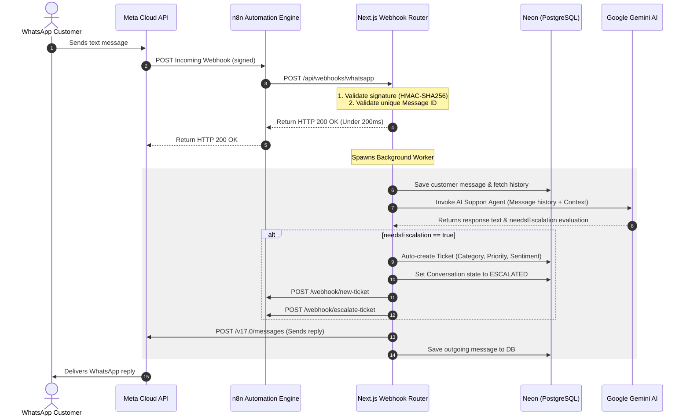

# FlowDesk AI V3.0 (Omnichannel WhatsApp Support Channel)

FlowDesk AI is a modern, production-ready, AI-powered customer support platform. Supercharged with stateful n8n automation, real-time AI categorization, sentiment alerts, and intelligent support summaries, it is fully integrated with a production-hardened **WhatsApp Support Channel**.

---

## 🏗️ Architecture & Data Flow

FlowDesk AI V3.0 employs an asynchronous, secure event-driven architecture designed to meet Meta's strict 5-second webhook response SLA while running stateful multi-turn AI chat agents.

### Webhook & Message Flow Architecture


---

## 🛠️ Complete Technology Stack

| Layer | Technology | Purpose |
| :--- | :--- | :--- |
| **Framework** | Next.js 15 (App Router) | Core server-side application hosting, API endpoints, Server Actions, and UI components. |
| **Language** | TypeScript | Strong typing across services, routing parameters, and API responses. |
| **Styling** | Tailwind CSS v4 | Responsive utility-first design with premium dark mode glassmorphism styles. |
| **Database & ORM** | Neon PostgreSQL + Prisma | Stateful storage with automatic schema synchronization, cascading deletes, and indexed sessions. |
| **AI Engine** | Google Generative AI | Gemini 2.5 Flash API handles dynamic client query responses and zero-shot ticket classification metadata. |
| **Automation** | n8n Workflows | Workflow engine mapping alerts to external channels (Email/Slack) and orchestrating lifecycle hooks. |
| **Security** | Auth.js v5 (NextAuth) | Multi-factor, secure OAuth 2.0 logins using Google Accounts. |
| **Tunneling** | Cloudflare Tunnel (`cloudflared`) | Local development tunnel forwarding public Meta webhook calls securely into port 3000. |

---

## ⚡ Production Hardening & Security Features

1. **HMAC-SHA256 Signature Verification**: Every POST webhook from Meta is validated against the `WHATSAPP_APP_SECRET` using timing-safe signature verification.
2. **Replay & Idempotency Protection**: A sliding-window in-memory cache logs processed Meta `message_id`s. Duplicate deliveries (e.g., due to carrier retries) are dropped and immediately acknowledged with `200 OK` without wasting Gemini API tokens or DB writes.
3. **Meta 5s Timeout Mitigation**: Separates heavy AI evaluation into background workers; Next.js acknowledges the Meta API within 200ms to eliminate Meta retry storms.
4. **Exponential Outbound Retries**: Outbound WhatsApp dispatches and n8n triggers use exponential backoff retries (max 3 retries, starting at 500ms delay) to withstand transient network failures.

---

## 📂 Directory Structure

```text
├── docs/
│   └── whatsapp-business-setup.md   # Setup guide for Meta Developer Portal, webhook routing & n8n
├── scripts/
│   └── test-whatsapp-flow.ts        # Integration test script for verifying API endpoints & DB
├── prisma/
│   └── schema.prisma        # Database schema definitions (includes TicketSource, WhatsApp Conversations)
├── workflows/
│   ├── whatsapp-incoming-workflow.json     # Intercepts incoming events and forwards to backend
│   ├── whatsapp-resolution-workflow.json   # Handles ticket resolutions and session closure
│   ├── high-priority-workflow.json         # Directs on-call alerts for high-priority tickets
│   └── auto-escalation-workflow.json       # original n8n escalation template
├── src/
│   ├── app/
│   │   ├── api/
│   │   │   ├── auth/        # Catch-all endpoint for Auth.js
│   │   │   ├── tickets/     # GET/PATCH endpoints for n8n polling
│   │   │   └── webhooks/whatsapp/  # Verification (GET) and incoming event (POST) webhook route
│   │   ├── dashboard/       # Protected support dashboard views
│   │   ├── tickets/         # Ticket listings, details, queues, and WhatsApp views
│   │   │   ├── whatsapp-simulator/  # Web-based local WhatsApp phone simulator
│   │   │   ├── whatsapp-history/    # Customer Inbox and chat transcript auditer
│   │   │   └── whatsapp-actions.ts  # Server actions for WhatsApp management
│   ├── lib/
│   │   ├── prisma.ts        # PrismaClient connection singleton
│   │   ├── config.ts        # Startup environment configuration schema validation
│   │   └── validation.ts    # Input Zod schemas
│   ├── services/
│   │   ├── ticket.service.ts   # Database CRUD, statistics & webhook dispatchers
│   │   ├── gemini.service.ts   # Unified Gemini API integration & fallback parser
│   │   ├── n8n.service.ts      # Webhook dispatch integrations with exponential retries
│   │   ├── whatsapp.service.ts # Stateful WhatsApp coordinator with retry policies
│   │   └── activity.service.ts # Activity logs query & writes
```

---

## 🚀 Setup & Verification

For detailed instructions on configuring the Meta Developer Portal, webhook callback routing, and n8n trigger integrations, please follow the **[WhatsApp Business API Setup Guide](file:///Users/pawan/Projects/Flowdesk%20AI/docs/whatsapp-business-setup.md)**.

### Running the Verification Test Suite:
To test the whole integration flow locally (incoming webhooks, signature checking, idempotency, ticket resolution):
```bash
# 1. Start the Next.js dev server:
npm run dev

# 2. Run the integration test suite:
npx tsx scripts/test-whatsapp-flow.ts
```
