# FlowDesk AI

**AI-powered, multi-tenant customer support desk with a WhatsApp-native front door.**

🌐 **Live demo:** [flow-desk-ai-rose.vercel.app](https://flow-desk-ai-rose.vercel.app/)

## Overview

FlowDesk AI is a support desk built around one idea: customers shouldn't need an account to get help. A company's support team runs their whole operation — ticket triage, SLA tracking, a knowledge base — from a web dashboard, but their customers reach them over **WhatsApp**, where an AI agent answers questions, grounds its replies in the company's own documentation (RAG), and escalates to a human ticket only when it can't confidently resolve something itself.

**Who it's for:** small-to-mid-size support/CS teams who want an AI-first omnichannel desk without standing up a full CX platform. Any number of separate companies can run on the same FlowDesk AI deployment, each with its own isolated tickets, knowledge base, team, and WhatsApp number — this is a genuine multi-tenant product, not a single-company internal tool.

**Core value proposition:** zero-effort AI ticket triage (category/priority/sentiment, auto-computed the moment a ticket is created) + an always-on WhatsApp support agent grounded in your own docs + enforced SLA discipline, on a lean, mostly-serverless stack (Next.js on Vercel + Neon Postgres + Gemini), with n8n handling notification fan-out so the core app stays fast and simple.

---

## Architecture

### Tech stack

| Layer | Technology | Notes |
| :--- | :--- | :--- |
| **Framework** | Next.js 15 (App Router) | Server Components, Server Actions, route handlers — one deployable app, no separate frontend/backend repos |
| **Language** | TypeScript | Strict; `next.config.ts` no longer suppresses type/lint errors at build time |
| **Styling** | Tailwind CSS v4 | Hand-rolled dark-mode "glass" UI, no component library |
| **Database** | Neon serverless PostgreSQL + `pgvector` | Vector column via Prisma `Unsupported("vector(3072)")`, since Prisma has no native vector type |
| **ORM** | Prisma v6 | Raw SQL (`$queryRaw`/`$executeRaw`) only where Prisma's query builder genuinely can't express the operation (vector similarity, correlated subquery aggregates) |
| **Auth** | Auth.js v5 (NextAuth), JWT strategy | Google OAuth only |
| **AI** | Google Generative AI SDK | `gemini-2.5-flash` for classification/chat, `gemini-embedding-001` for embeddings (3072-dim) |
| **Automation** | n8n (external service) | Outbound-only webhook fan-out for notifications; this repo ships JSON workflow exports, not n8n itself |
| **Messaging** | Meta WhatsApp Cloud API | HMAC-SHA256 signed webhooks |
| **Scheduling** | GitHub Actions | Vercel's Hobby-tier cron is once-a-day, far too coarse for a 15-minute SLA — see [Deployment](#getting-started--deployment) |

### System flow (WhatsApp — the core path)

```mermaid
sequenceDiagram
    autonumber
    actor Customer as WhatsApp Customer
    participant Meta as Meta Cloud API
    participant NextJS as Next.js Webhook Router
    participant DB as Neon (PostgreSQL + pgvector)
    participant Gemini as Google Gemini AI
    participant n8n as n8n Automation Engine

    Customer->>Meta: Sends text message
    Meta->>NextJS: POST /api/webhooks/whatsapp (Signed)
    Note over NextJS: 1. Verify HMAC-SHA256 signature<br/>2. Durable idempotency check (DB, not in-memory)
    NextJS-->>Meta: Return HTTP 200 OK (Under 200ms)

    Note over NextJS: Spawn background worker (waitUntil)
    rect rgb(30, 30, 30)
        NextJS->>DB: Resolve org (phone_number_id → Organization)
        NextJS->>DB: Fetch/create WhatsAppConversation
        NextJS->>DB: RAG similarity search (pgvector <=> query)
        NextJS->>Gemini: AI agent call (query + grounding chunks)
        Gemini-->>NextJS: Reply text + escalation decision (JSON)
        alt needsEscalation == true
            NextJS->>DB: Create Ticket (category, priority, sentiment)
            NextJS->>DB: Log Activity timeline
            NextJS->>n8n: POST org's new-ticket / escalation webhook (non-blocking)
        end
        NextJS->>Meta: Send outbound WhatsApp reply
        NextJS->>DB: Log outgoing message
    end
    Meta->>Customer: Delivers WhatsApp reply
```



### The sync/async split

Meta enforces a **5-second webhook timeout**. Everything on the "must respond fast" path is synchronous (signature verification, idempotency claim, the `200 OK` itself); everything slow or external (Gemini calls, n8n dispatch, WhatsApp send retries) is pushed to a detached background task via Next.js/Vercel's `waitUntil`. n8n specifically is treated as an **untrusted, best-effort sink** — every trigger function returns `{success, status, data, error}` rather than throwing, so a down or unconfigured n8n instance never fails a ticket creation or a customer-facing reply.

### RAG pipeline

1. **Extraction** — `.txt`, `.pdf` (`pdf-parse`, with a manual `DOMMatrix` polyfill since it expects browser globals that don't exist server-side), `.docx` (shells out to `unzip` + strips XML tags, with a raw binary-scan fallback).
2. **Chunking** — 1000-character windows, 200-character sliding overlap.
3. **Embedding** — `gemini-embedding-001`, 3072-dim vectors, via `batchEmbedContents` (one HTTP call embeds an entire sub-batch of up to 100 chunks server-side, instead of one round-trip per chunk — see [Notable Engineering Decisions](#notable-engineering-decisions)).
4. **Storage** — raw SQL `UPDATE ... SET embedding = $1::vector`, since Prisma has no native vector write path.
5. **Retrieval** — cosine distance (`<=>` operator) via raw SQL, results above a similarity threshold (0.7 live / 0.5 for the manual search-test panel) injected into the Gemini prompt.
6. **Stuck-job recovery** — ingestion runs as a detached background promise with no durable job queue behind it; if the serverless function is frozen mid-task, the document is left in `PROCESSING` with no automatic retry. A recovery sweep (`recoverStuckDocuments`, cron-driven every 5 minutes) finds documents stuck past 10 minutes and marks them `FAILED` with a clear reason plus cleans up any partial chunks — it does not resume, since the uploaded file only ever existed as an ephemeral path on one serverless instance. Re-indexing is a re-upload.

### SLA engine

Deadlines are computed at ticket-creation time based on priority:

| Priority | Response target | Resolution target |
| :--- | :--- | :--- |
| CRITICAL / HIGH | 15 minutes | 1 hour |
| MEDIUM | 1 hour | 4 hours |
| LOW | 4 hours | 24 hours |

A breach sweep (`checkSLABreaches`, cron-driven every 5 minutes) scans **all orgs in one query** — the breach condition is intrinsic to each ticket row, not org-dependent, so there's no correctness reason to run N separate per-org sweeps. Each breach is claimed atomically (`UPDATE ... WHERE slaBreached = false`, re-checked at write time) so overlapping cron invocations can't double-process the same breach or fire duplicate webhooks. Webhook configs for all orgs touched by a sweep are batch-fetched once up front rather than once per ticket, and breach activity logs are written via a single `createMany` after all claims resolve, rather than one insert per ticket.

### Webhook hardening

- **Immediate ack**: `200 OK` under 200ms; heavy work moves to `waitUntil`.
- **HMAC-SHA256 verification** against `WHATSAPP_APP_SECRET` (`X-Hub-Signature-256`).
- **Durable, DB-backed idempotency**: a `ProcessedWebhookEvent` table with a unique constraint on Meta's message ID — each inbound message is claimed with an atomic `INSERT`; a constraint violation means it's already been seen. This replaced an in-memory `Set`, which reset on every Vercel cold start and couldn't reliably catch Meta's up-to-7-day redelivery window. Claimed IDs are pruned after that window via a lightweight, ~1%-sampled background cleanup — no dedicated cron needed.

---

## Multi-tenancy model

FlowDesk AI is genuinely multi-tenant: every ticket, activity, WhatsApp conversation, and knowledge-base document is scoped to an `Organization`. Here's how the moving parts fit together.

### Org structure and roles

Each `User` belongs to at most one `Organization` (`organizationId` is nullable — a user can be authenticated with no org yet) with exactly one of two roles:

- **OWNER** — the org's creator. Can invite teammates, approve/reject join requests, configure n8n webhook URLs, remove members. Every org always has exactly one OWNER by construction (no in-app path ever creates a second one, and no in-app path ever removes the last one) — this keeps "who can approve access" unambiguous without needing a real permissions system.
- **MEMBER** — everyone else. Role is checked at a handful of OWNER-gated Server Actions (sending invites, removing members, saving webhook config, approving/rejecting join requests) — beyond those five checks, OWNER and MEMBER see the same tickets, same WhatsApp conversations, same knowledge base. There's no broader RBAC layer; the dashboard's OWNER-only *widgets* (team overview, integration health) are a content difference, not an authorization difference.

### Two ways to join an org

1. **Owner-initiated invite** — an OWNER enters a teammate's email; an `Invite` row is created (single-use, email-targeted, 7-day expiry, `crypto.randomBytes(32)` token). The invitee clicks their link, signs in with Google, and — since Auth.js's `jwt` callback only fires with a populated `user` object at actual sign-in time — the org/role assignment happens then, with zero extra DB round-trips beyond what Auth.js's adapter already does at login.
2. **Join request** — a first-time Google sign-in with no invite is allowed through (this used to be rejected outright) and lands the user in an authenticated-but-orgless state. From there they enter their target org's owner's email; a `JoinRequest` is created and the owner approves or rejects it from Settings. Approval always assigns `MEMBER` — there's no field on the request that could grant OWNER, which keeps the one-OWNER invariant airtight by construction rather than by convention.

Org creation itself reuses the invite mechanism rather than being a separate code path: creating an org creates a self-targeted `OWNER`-role invite, so "sign up as a new company" and "accept a teammate invite" are mechanically the same flow from the auth layer's point of view.

### Session staleness

JWT-strategy sessions are fast (no DB read on every request) but structurally can't notice a DB-side change — like a user being removed from their org — until the token itself expires (default 30 days). Rather than switch to database-strategy sessions (correct, but a broad rewrite of the whole auth mechanism for a narrower problem) or just shorten the JWT lifetime (doesn't add any DB check within the window, just shrinks it, at a real re-auth UX cost), every protected page does one extra indexed lookup — `User.id` is the primary key, so this is the cheapest possible read — comparing the DB's current `organizationId`/`role` against what's baked into the token. A mismatch forces a fresh sign-in, which cleanly re-runs the token-issuing logic. This is the same DB round-trip every protected page was already about to make anyway (it's about to run an org-scoped ticket/document query), just moved one query earlier.

Removal is always a field update (`organizationId: null, role: null`), **never** a `User` row deletion — deleting the row would cascade-delete every ticket, activity, and invite that user ever touched, silently destroying org history. This discipline is verified structurally, not just by convention: `Ticket.organizationId` and `Activity.organizationId` are independent columns with no relation path back through `User`, so there's nothing that *could* cascade from a field update.

### Per-org WhatsApp and n8n routing

Each org can map its own WhatsApp Business `phone_number_id` (via a `WhatsAppNumberMapping` table, not a 1:1 field, so one org can register multiple numbers later) — inbound webhooks resolve which org owns a message by reading that ID out of Meta's payload before any conversation lookup happens. n8n webhook URLs are equally per-org (`OrganizationWebhookConfig`, one row per org, 5 nullable URL fields for the 5 event types) rather than global env vars — with multiple orgs on one deployment, a shared webhook URL would mean every org's alerts land in the same n8n workflow with no routing. An org that hasn't configured a given webhook simply has that event type skipped; there is no global fallback.

---

## Getting Started / Deployment

### 1. Local setup

```bash
git clone https://github.com/pawan646435/FlowDesk-AI.git
cd FlowDesk-AI
npm install
cp .env.example .env   # fill in real values, or use "mock" for WhatsApp vars — see below
npx prisma db push
npm run dev
```

Open [http://localhost:3000](http://localhost:3000). All `WHATSAPP_*` env vars can be set to the literal string `"mock"` for local dev — the app detects this and logs instead of calling the real Meta Graph API, so the whole pipeline (including the `/tickets/whatsapp-simulator` dev sandbox) works without a real Meta account.

### 2. Google Cloud Console (OAuth)

1. [Credentials screen](https://console.cloud.google.com/apis/credentials) → create/select a project.
2. Configure the OAuth consent screen (External user type, app name, support email).
3. Create an OAuth Client ID (Web application) with:
   - Authorized JS origin: `https://your-domain.vercel.app`
   - Authorized redirect URI: `https://your-domain.vercel.app/api/auth/callback/google`
4. Copy `Client ID`/`Client Secret` into `AUTH_GOOGLE_ID`/`AUTH_GOOGLE_SECRET`.

### 3. Neon (PostgreSQL + pgvector)

1. Create a project at [neon.tech](https://neon.tech/).
2. In the SQL editor: `CREATE EXTENSION IF NOT EXISTS vector;`
3. Use the **pooled** connection string (`-pooler` suffix) as `DATABASE_URL` — serverless cold starts will exhaust connection limits on the non-pooled string.

### 4. Meta (WhatsApp Cloud API)

1. Create a Business-type app at the [Meta Developer Dashboard](https://developers.facebook.com/), add the WhatsApp product.
2. Create a System User in Meta Business Suite, generate a **permanent** access token (not the 24h temporary dashboard token) → `WHATSAPP_ACCESS_TOKEN`.
3. Copy the Phone Number ID and App Secret → `WHATSAPP_PHONE_NUMBER_ID`, `WHATSAPP_APP_SECRET`.
4. Set a verify token of your choosing → `WHATSAPP_VERIFY_TOKEN`.
5. Configure the webhook: callback URL `https://your-domain.vercel.app/api/webhooks/whatsapp`, subscribed to the `messages` field.

### 5. Vercel

1. Import the repo, build command `npx prisma generate && next build` (Prisma client must generate before route handlers that import it compile).
2. Set env vars: `DATABASE_URL`, `AUTH_SECRET` (`npx auth secret`), `NEXTAUTH_URL`, `AUTH_GOOGLE_ID`, `AUTH_GOOGLE_SECRET`, `GEMINI_API_KEY`, the 5 `WHATSAPP_*` vars, `CRON_SECRET` (`openssl rand -hex 32`).
3. n8n webhook URLs are **not** env vars — each org configures its own 5 from its Settings page after deployment.

### 6. n8n

- **Local**: `docker compose up -d`, console at `localhost:5678`.
- **Production**: Railway's Postgres-backed n8n template (avoids SQLite write-locking). Import the workflows in `workflows/` — **not** `workflows/deprecated/high-priority-workflow.json`, which shares a webhook path with `auto-escalation-workflow.json` and will silently fail to register if both are active.
- Webhook URLs are set per-org from the app's Settings page, not as env vars.

### 7. Scheduled checks (GitHub Actions)

Vercel Hobby's cron is once-a-day — far too coarse for a 15-minute CRITICAL SLA — so both sweeps run via GitHub Actions instead:

1. Set `CRON_SECRET` (same value as Vercel) and `PRODUCTION_URL` (no trailing slash) as **repository secrets** under Settings → Secrets and variables → Actions.
2. `.github/workflows/sla-check.yml` and `.github/workflows/rag-recovery-check.yml` run every 5 minutes, `Authorization: Bearer <CRON_SECRET>` against `/api/tickets/sla-check` and `/api/knowledge-base/recover-stuck` respectively, failing the job (visible in Actions) on a non-2xx response.

### Troubleshooting

- **401 on outbound WhatsApp**: temporary Meta tokens expire in 24h — use a permanent System User token.
- **PrismaClientInitializationError**: Neon free-tier databases sleep after 5 minutes idle; expect a brief cold-start spin-up.
- **`ReferenceError: DOMMatrix is not defined`**: already handled by a polyfill in the PDF ingestion path — if you see this, you're likely on an older build.

---

## Project structure

```text
prisma/schema.prisma          # All models, enums, the pgvector column
workflows/                    # n8n workflow JSON exports (imported into a separate n8n instance)
  └── deprecated/              # Superseded workflows kept for reference — see its README before importing
scripts/                      # Manual integration tests + one runnable dev-integration script (npx tsx)
src/
  app/
    api/                       # Webhook + REST-ish route handlers (WhatsApp, tickets, knowledge base)
    dashboard/                 # Role-differentiated analytics dashboard + KB management UI
    tickets/                   # List/detail/queue views, WhatsApp simulator + agent inbox
    settings/                  # Org profile, team management, invites, join requests, webhook config
    onboarding/                # Authenticated-but-orgless landing (join-request flow)
    create-organization/       # Self-invite org signup
    accept-invite/             # Invite-link landing page
  components/                  # Shared UI — navbar, dialogs, form/button components
  services/                    # Business logic layer — one *.service.ts per domain
    ticket.service.ts            # Ticket CRUD, stats aggregation
    whatsapp.service.ts          # Inbound/outbound WhatsApp orchestration
    gemini.service.ts            # AI classification + WhatsApp agent, with rule-based fallbacks
    rag.service.ts                # Embeddings (single + batch) + pgvector similarity search
    knowledge.service.ts         # Document parsing, chunking, ingestion pipeline
    sla.service.ts                # Deadline calc, breach sweep, dashboard stats
    n8n.service.ts                 # Webhook dispatch with retry, per-org config resolution
    organization.service.ts       # Org/invite/membership/join-request logic
    activity.service.ts           # Audit log reads
  lib/
    prisma.ts                    # PrismaClient singleton (also triggers env validation on import)
    session.ts                    # getVerifiedSession() — the staleness-check helper every protected page uses
    config.ts                     # Zod-validated required env vars, runs at module load
    validation.ts                  # Zod schemas for forms/Server Action payloads
  auth.ts / auth.config.ts      # Auth.js setup — Google OAuth, JWT callbacks, org/role assignment
  middleware.ts                  # Route-level auth gating
```

---

## Notable Engineering Decisions

A few things worth calling out for anyone reading this as a portfolio piece — not exhaustive, but the pieces with real design weight behind them.

**Compare-and-swap concurrency for both cron sweeps.** The SLA breach sweep and the stuck-document recovery sweep both follow the same pattern: `findMany` candidates, then for each one, `updateMany({ where: { id, <still-in-the-expected-state> } })`. If a concurrent/overlapping cron invocation already claimed that row between the read and the write, the update's affected-row count comes back 0 and the claim is skipped — no duplicate activity logs, no duplicate webhook fires, no lost work, without needing a distributed lock.

**Session staleness via one indexed lookup, not a rewritten auth strategy.** Detailed above — the interesting part is the reasoning process: shortening JWT `maxAge` was rejected because it doesn't add a DB check *within* the window, only shrinks it, at a real re-auth cost; switching to database-strategy sessions was rejected as disproportionate (it would restructure the whole `jwt`/`session` callback split for a problem a single extra query already solves). The eventual fix piggybacks on a query every protected page was already about to run.

**A real, measured performance pass**, not guesswork:

- *Bundle analysis*: installed `@next/bundle-analyzer`, found `/create-organization` was shipping zod's entire validation engine to the client (59.3 KB parsed) just to read one exported constant that shared a module with the zod schemas. Moving the constant to its own file dropped that route's First Load JS from 123 kB to 106 kB — confirmed via the analyzer's own chunk output before/after, not assumed.
- *N+1 and over-fetch audit*: grepped every service file for query-per-loop-iteration patterns and full-relation fetches used for a single derived value. Found the dashboard's SLA metrics query pulling every responded ticket's *entire* activity relation into memory just to compute one average response time — rewritten as a single `LATERAL JOIN` + `MIN()`/`AVG()` raw SQL query. Verified numerically identical output against the old in-memory calculation across 5 hand-built edge cases (multiple qualifying activities, exclusion-prefix-only activity histories, etc.) before trusting the rewrite. Measured with an interleaved old/new/new/old timing methodology (to cancel out DB connection warm-up bias that skewed an earlier, flawed same-block measurement) — **2.2x faster** on a seeded 200-row dataset.
- *Sequential embedding calls*: `processAndIndexDocument` was doing one Gemini API call per chunk in a `for` loop. Confirmed `gemini-embedding-001` supports `batchEmbedContents` (multiple texts, one HTTP call) against the live API and current docs rather than assuming — a batch size claim found in a forum thread turned out to be about a *different* feature (the async offline Batch API). Rewrote to batch up to 100 chunks per call; measured on a real 4-chunk document end-to-end: **9.1s → 6.9s**. An isolated 12-text embedding benchmark (no DB writes or text extraction, just the raw Gemini calls) showed a larger 8.7s → 2.3s gap, though real-document speedup at scale will land somewhere between the two, since DB writes and text extraction are a fixed cost the batching doesn't reduce.
- *Dashboard streaming*: found the dashboard's SLA metrics query consistently 2-3x slower than every other widget's query. Rather than wrap broad sections in Suspense speculatively, split that one query out and streamed just that card in separately — everything else renders immediately. Measured **~2.1x faster** time-to-first-non-SLA-content.

**Deliberately not over-designed.** Multiple points in the multi-tenancy/onboarding design work explicitly declined to build machinery for scenarios no in-app code path can actually reach — e.g., no promote/transfer-ownership UI, because no action in the app can ever produce a second OWNER or remove the last one, so the "orphaned org" scenario the machinery would solve for isn't reachable without a deliberate out-of-band database edit. The guardrail that matters (never let removal/leave logic touch an OWNER) is cheap to state and enforce directly; the UI to handle a state nothing can produce isn't.

**Everything above was investigated, not assumed**, as a matter of practice throughout the project — e.g. tracing `@auth/core`'s actual source to confirm the JWT callback's `user` parameter really is only populated at sign-in (not on every token refresh) before designing session staleness around that fact, rather than trusting documentation or intuition.
